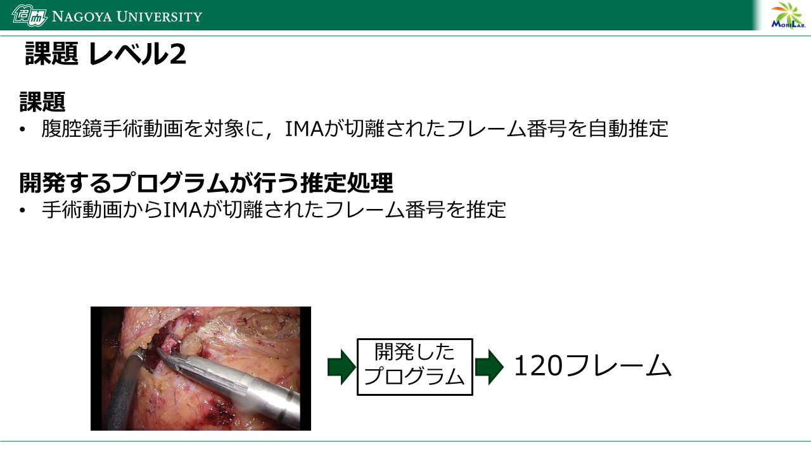
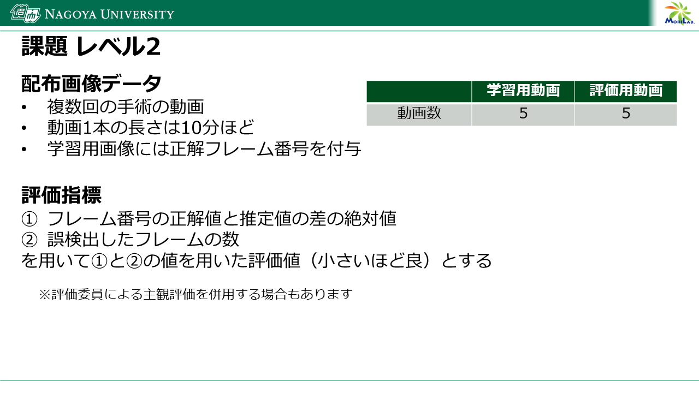

# Advanced Challenge

## 課題
腹腔鏡下S状結腸切除術の手術動画を対象に，動画内の各工程シーンの認識

## 開発するプログラムが行う推定処理
手術動画から各手術工程(11クラス)シーンの開始と終了のフレーム番号を推定  
※Basic Challengeから工程x(体外クラス)が追加されています。工程xのフレームは匿名加工のため黒に塗りつぶしています。

|手術工程(クラス)|説明|
|-----|-----|
|工程1|岬角より尾側の内側授動。正中より右側のMesenteric excision（ME）  |
|工程2|岬角より頭側かつIMA/SRAより右側の内側授動  |
|工程3|IMA処理 |
|工程4|IMA/SRAより左側の内側授動 |
|工程5|SDJより頭側の外側授動 |
|工程6|SDJより尾側の外側授動。正中より左側のME |
|工程7|切離予定線上の直腸間膜処理 |
|工程8|直腸切離～吻合 |
|工程13|工程終了～手術終了まで|
|工程o (アルファベットのoです)|その他|
|工程x (アルファベットのxです)|体外。匿名加工のため、画像を黒塗りしています|



## 配布画像データ
複数回の手術の動画

## 評価指標
1. フレーム番号の正解値と推定値の差の絶対値
2. 誤検出したフレームの数

を用いて1.と2.の値を用いた評価値（小さいほど良）とする

※評価委員による主観評価を併用する場合もあります


## 提出物
評価用動画（締切が近づいたら公開予定）に対して，開発したプログラムが自動推定した各手術動画に対する各工程シーンの開始と終了のフレーム番号を提出していただきます．

- 評価用動画から算出したフレーム番号を記録したファイル submission.csv
   - File列に動画ファイル名，自動推定した開始フレーム番号をStartFrame、終了フレーム番号をEndFrame、ラベル値をCategory列に記入したcsvファイルを作成してください．ラベル値は以下を使用してください．
      - 工程1: 1
      - 工程2: 2
      - 工程3: 3
      - 工程4: 4
      - 工程5: 5
      - 工程6: 6
      - 工程7: 7
      - 工程8: 8
      - 工程13: 13
      - 工程o: o
      - 工程x: x
   - submission.csvファイルは以下のフォーマットとしてください．

```
File,StartFrame,EndFrame,Category   
video001,0,124,1
video001,125,326,2
```

- 手法の概要原稿
   - 使用した手法を説明した原稿をメールで提出してください．原稿フォーマットは日本コンピュータ外科学会大会のものを使用してください．ページ数は1ページまたはそれ以上でも可です．

メールに代表者の連絡先情報（お名前，ご所属，連絡先メールアドレス，電話番号，第33回日本コンピュータ外科学会大会（2025年11月21日～23日開催）への参加可否（代理可），その他連絡事項）をご記載いただき，上記提出物と共に以下にメールで提出してください．

提出先メールアドレス：
jscas-aichallenge@mori.m.is.nagoya-u.ac.jp
