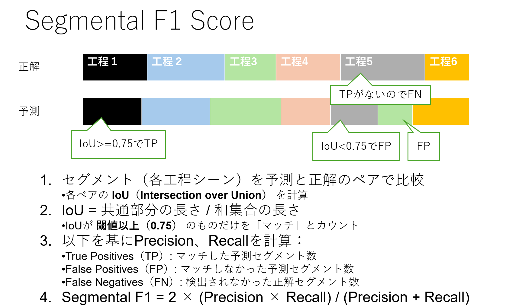

# Advanced Challenge

## 課題
腹腔鏡下S状結腸切除術の手術動画を対象に，動画内の各工程シーンの認識

## 開発するプログラムが行う推定処理
手術動画から各手術工程(11クラス)シーンの開始と終了のフレーム番号を推定  
※Basic Challengeから工程x(体外クラス)が追加されています。工程xのフレームは匿名加工のため黒に塗りつぶしています。

|手術工程(クラス)|説明|
|-----|-----|
|工程1|岬角より尾側の内側授動。正中より右側のMesenteric excision（ME）  |
|工程2|岬角より頭側かつIMA/SRAより右側の内側授動  |
|工程3|IMA処理 |
|工程4|IMA/SRAより左側の内側授動 |
|工程5|SDJより頭側の外側授動 |
|工程6|SDJより尾側の外側授動。正中より左側のME |
|工程7|切離予定線上の直腸間膜処理 |
|工程81|直腸切離～吻合で工程82, 83に属さないシーン |
|工程82|直腸切離 |
|工程83|吻合 |
|工程9|IMV（LCA）処理 |
|工程13|工程終了～手術終了まで|
|工程x (アルファベットのxです)|体外。匿名加工のため、画像を黒塗りしています|


## 配布動画データ
- 複数回の手術の動画

|学習用動画数|評価用動画数|
|-----|-----|
|12|4|

- 動画に対して各工程シーンの開始フレームをアノテーションしたCSV。フォーマットは以下(実際は工程の順番はバラバラです)
```
start-frame,phase-id
0,x
245,1
709,2
1530,3
2350,4
2598,5
3193,6
3259,7
5161,81
5234,82
6056,83
6378,9
6912,13
...
```

## 評価指標
動画中のシーンの検出精度を時間的なセグメント単位で評価する指標として、Segmental F1 Score (F1@0.75)を用いた評価値とする  



※評価委員による主観評価を併用する場合もあります  

## 提出物
評価用動画（締切が近づいたら公開予定）に対して，開発したプログラムが自動推定した各手術動画に対する各工程シーンの開始フレーム番号を提出していただきます．

- 評価用動画毎に算出した各工程分類シーンの開始を記録したファイル submission_[動画名].csvを格納したsubmission.zip
   - 自動推定した開始フレーム番号をstart-frame、ラベル値をphase-id列に記入したcsvファイルを作成してください．ラベル値は以下を使用してください．
      - 工程1: 1
      - 工程2: 2
      - 工程3: 3
      - 工程4: 4
      - 工程5: 5
      - 工程6: 6
      - 工程7: 7
      - 工程81: 81
      - 工程82: 82
      - 工程83: 83
      - 工程9: 9
      - 工程13: 13
      - 工程x: x
   - submission_[動画名].csvファイルはアノテーションCSVと同様に以下のフォーマットとしてください．

```
start-frame,phase-id
0,x
245,1
709,2
1530,3
2350,4
2598,5
3193,6
3259,7
5161,81
5234,82
6056,83
6378,9
6912,13
...
```

- 手法の概要原稿
   - 使用した手法を説明した原稿をメールで提出してください．原稿フォーマットは[日本コンピュータ外科学会大会のもの](https://jscas34.jp/cfa.html)を使用してください．ページ数は1ページまたはそれ以上でも可です．

メールに代表者の連絡先情報（お名前，ご所属，連絡先メールアドレス，電話番号，[第34回日本コンピュータ外科学会大会（2025年11月21日～23日開催）](https://jscas34.jp/)への参加可否（代理可），その他連絡事項）をご記載いただき，上記提出物と共に以下にメールで提出してください．

提出先メールアドレス：
jscas-aichallenge@mori.m.is.nagoya-u.ac.jp
